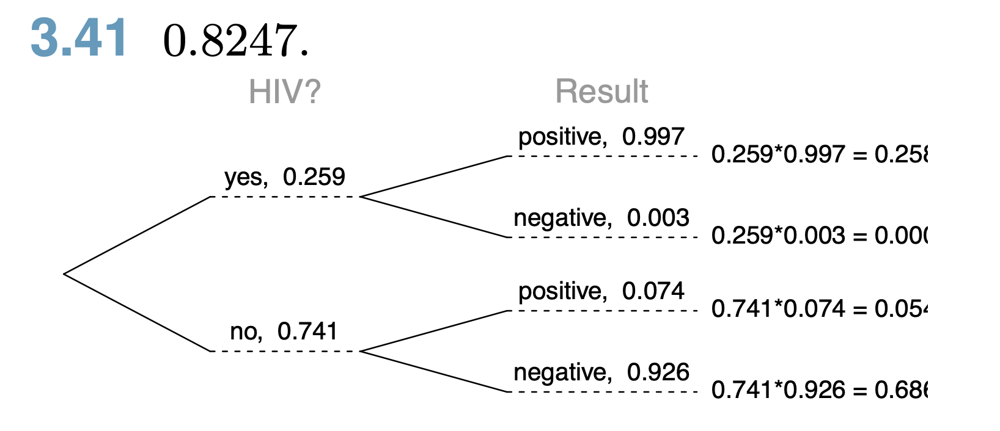

```{r setup, include=FALSE}
knitr::opts_chunk$set(echo = TRUE)
```

## 

3.41 HIV in Swaziland. Swaziland has the highest HIV prevalence in the world: 25.9% of this country’s population is infected with HIV.65 The ELISA test is one of the first and most accurate tests for HIV. For those who carry HIV, the ELISA test is 99.7% accurate. For those who do not carry HIV, the test is 92.6% accurate. If an individual from Swaziland has tested positive, what is the probability that he carries HIV?

```{r}
# Given probabilities
prevalence <- 0.259         # P(HIV)
sensitivity <- 0.997        # P(Test positive | HIV)
specificity <- 0.926        # P(Test negative | no HIV)

# Calculate false negative rate and false positive rate
false_negative_rate <- 1 - sensitivity
false_positive_rate <- 1 - specificity

# Population of 100,000 for easier calculations
population <- 100000

# HIV positive and negative counts
hiv_positive <- prevalence * population
hiv_negative <- (1 - prevalence) * population

# True positive, false positive, false negative, true negative counts
true_positive <- sensitivity * hiv_positive
false_negative <- false_negative_rate * hiv_positive
false_positive <- false_positive_rate * hiv_negative
true_negative <- specificity * hiv_negative

# Create the contingency table
contingency_table <- matrix(c(true_positive, false_positive, false_negative, true_negative),
                            nrow = 2, byrow = TRUE,
                            dimnames = list("Test Result" = c("Positive", "Negative"),
                                            "HIV Status" = c("HIV Positive", "HIV Negative")))

# Calculate total population (sum of all entries in the contingency table)
total_population <- sum(contingency_table)

# Create proportional table by dividing each entry by the total population
proportional_table <- contingency_table / total_population

# Display the proportional table
proportional_table
```


```{r}
# Load necessary libraries
library(ggplot2)
library(dplyr)
library(ggmosaic)

# Convert the contingency table to a data frame
contingency_df <- as.data.frame(as.table(contingency_table))

# Create the mosaic plot with manual color specification
ggplot(data = contingency_df) +
  geom_mosaic(aes(x = product(HIV.Status), fill = Test.Result, weight = Freq)) +
  scale_fill_manual(values = c("Positive" = "lightblue", "Negative" = "tomato")) +  # You can customize these colors
  labs(title = "Proportional Mosaic Plot of HIV Test Results in Swaziland (Flipped Colors)",
       x = "HIV Status", y = "Proportion") +
  theme_minimal()
```

Note created with assistant of ChatGPT4o.