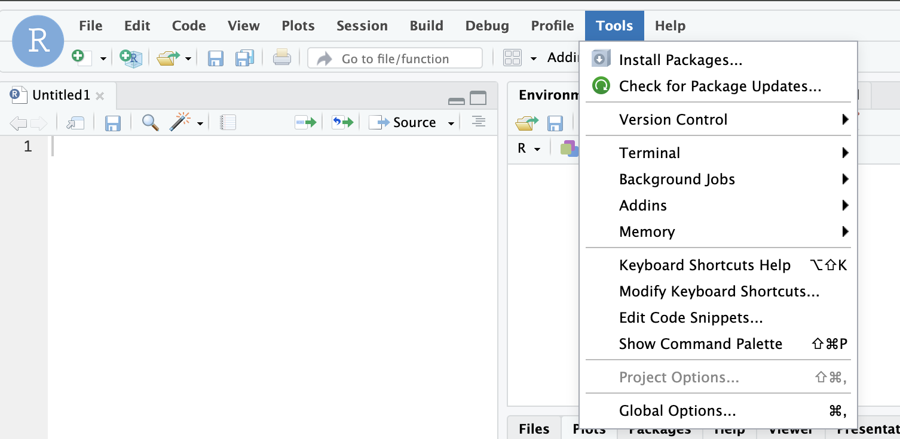
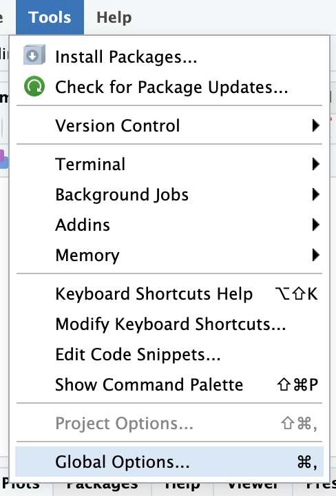
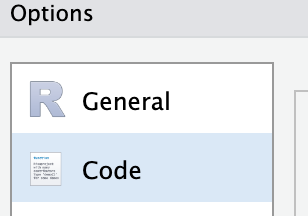
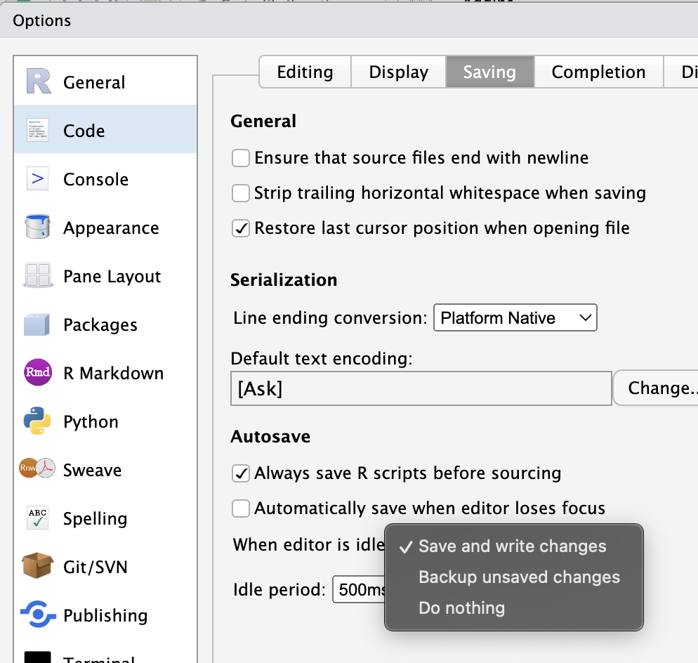
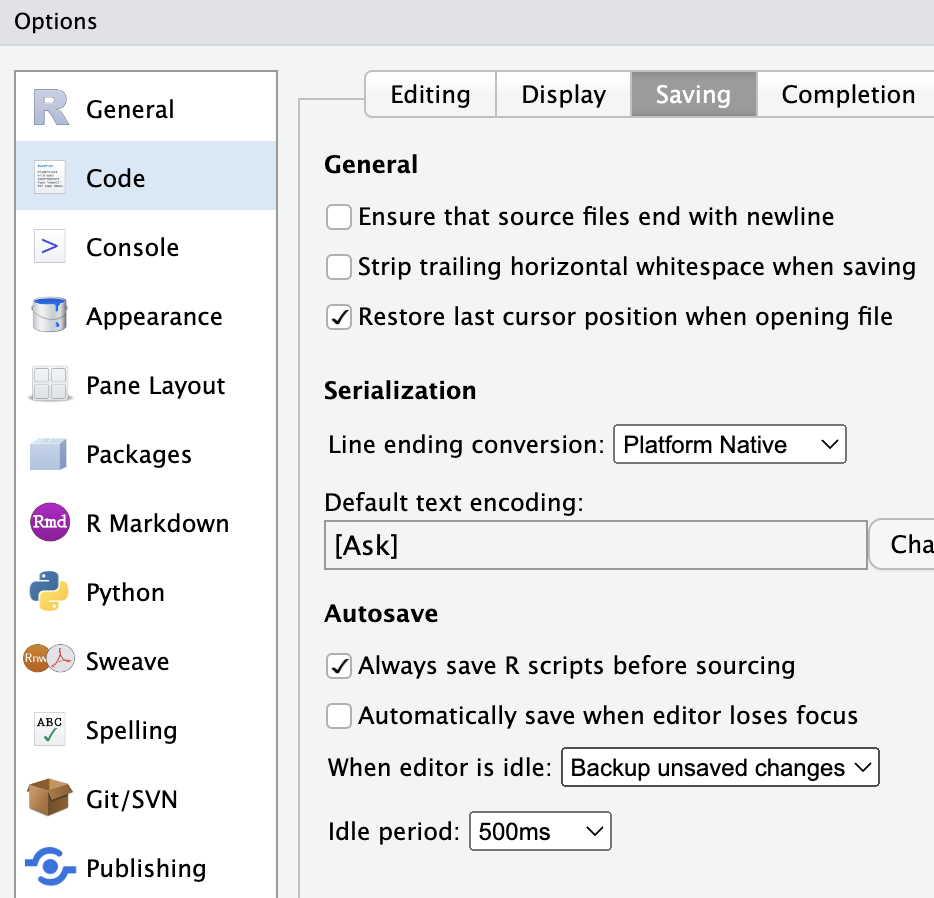
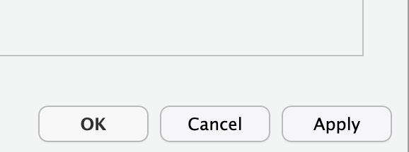

This has not been fully verified, but we are testing the setting.

Follow the instructions to change the setting:

1. 

1. 

1. 

1. 

1. 

1. ## Make sure you have "Backup unsaved changes"

1. 

Please send your feedback (or complaint) to the instructor.